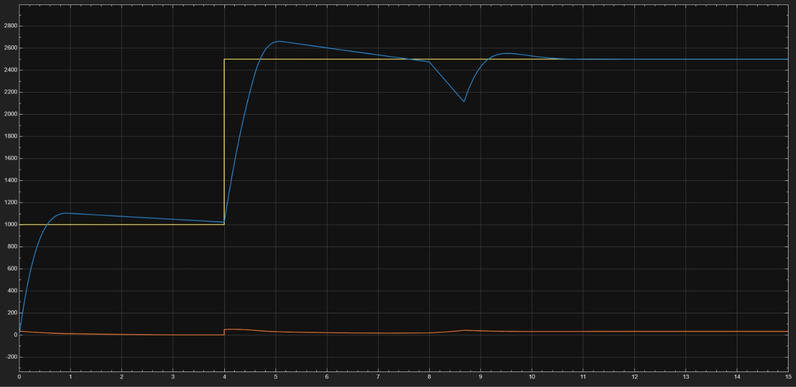
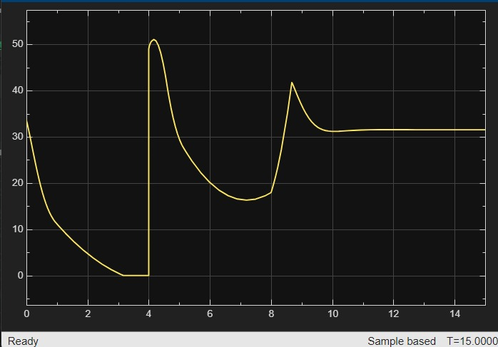

# Closed-Loop DC Motor Speed Control using PI Controller

## Overview

This project implements a closed-loop DC motor speed control system
using a PI controller, PWM generation and an H-Bridge motor driver.

The system continuously compares the desired motor speed with the
measured RPM and adjusts the PWM duty cycle to minimize the speed error.

## Control Architecture

Reference RPM
      ↓
   Error
      ↓
 PI Controller
      ↓
 PWM Duty Cycle
      ↓
  H-Bridge
      ↓
   DC Motor
      ↓
 Speed Sensor
      ↓
 Feedback

 ## Tools Used

- MATLAB
- Simulink
- Simscape Electrical
- PI Controller
- PWM
- H-Bridge
- DC Motor
- ESP32 (planned hardware implementation)

## Simulation Parameters

- PWM Frequency: 10 kHz
- Motor Supply: 12 V
- Controller: PI
- Kp: 0.004
- Ki: 0.01
- Kd: 0

## Results

The system was tested for:

1. Reference speed tracking
2. Speed transition from 1000 RPM to 2500 RPM
3. Mechanical load disturbance
4. PWM duty-cycle response

The controller increased the PWM duty cycle when the motor experienced
additional mechanical load and subsequently recovered the motor speed
toward the reference value.

### Speed Response

### PWM Response

